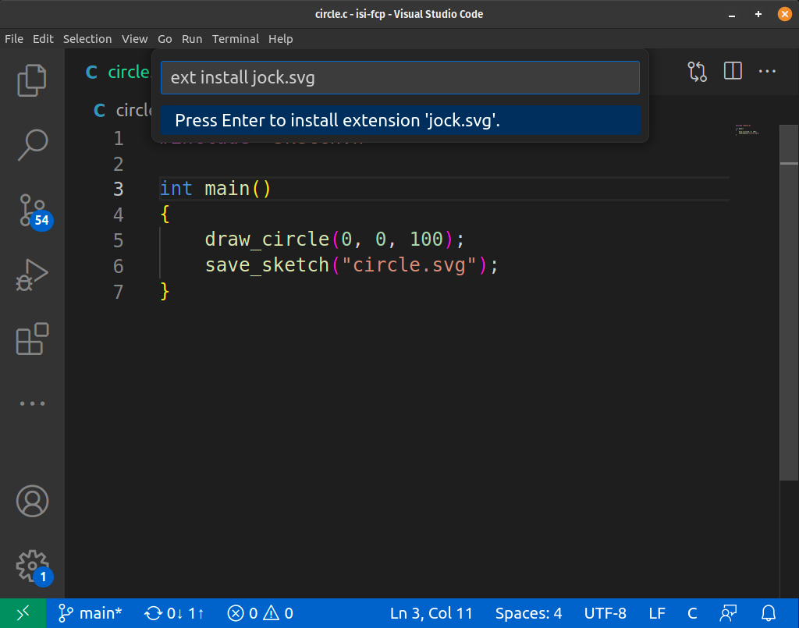
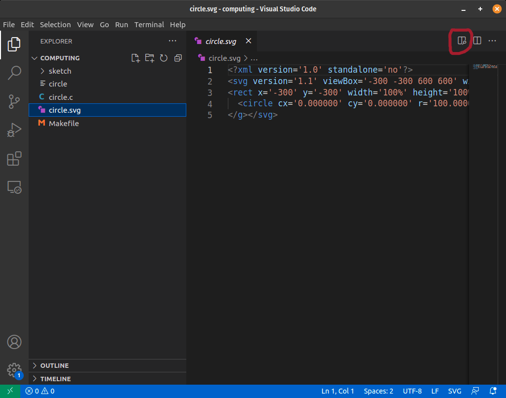
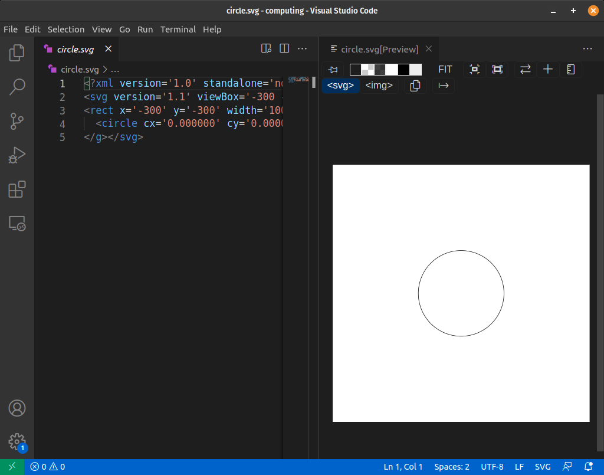

# Software Setup

This page explains how to setup the coding environment for Ubuntu.

!!! note

    If you are have a computer running Windows, please follow instructions on [Installing Ubuntu on Windows using WSL](ubuntu-wsl.md) before moving further.

## Install C compiler

For this course, we support only Ubuntu distribution of Linux. If you have any other distribution, please find out how to install GCC compiler.

Run the following commands to install C compiler and other build tools.

```
sudo apt-get update
sudo apt-get install build-essential
```

## Install Visual Studio Code

Visual Studio Code (vscode) is the recommended editor for this course. Please install it from [Visual Studio Code Downloads][2] page.

[2]: https://code.visualstudio.com/download

## Install SVG extension in vscode

Follow the following instructions to install [SVG Extension][svg-ex] to preview SVG files directly in vscode. SVG is an image format that we are going to use in the course.

1. Open vscode and press `Ctrl+P`**
2. Type `ext install jock.svg` and press Enter



[svg-ex]: https://marketplace.visualstudio.com/items?itemName=jock.svg

## Make a directory for your code

It is recommended to create a new directory for all your programs in this course. Let's call it `computing`.

Open your terminal and run the following command.

```
mkdir computing
```

You can change the current directory to that using:

```
cd computing
```

## Download CSketch library

[CSketch][] is a library for drawing simple shapes in C programming language and it is required for this course.

Run the following command in your terminal to install it.

```
curl https://anandology.github.io/csketch/install.sh | bash
```

[CSketch]: https://anandology.github.io/csketch/

This will download the csketch library to your current directory and also adds a sample file `circle.c` and a `Makefile` to build your C code.

## Build your first program

Run `make` to compile the `circle.c` file in the current directory.

```
$ make
gcc -I sketch -L sketch circle.c  -lm -l sketch -o circle
```

That compiled the `circle.c` and created executable file `circle`.

Run the `circle` program.

```
$ ./circle
```

That would have created a file `circle.svg`.

Open `vscode` to see the SVG image.

```
$ code .
```

That will open _vscode_ with all the files in the current directory. Select `circle.svg` and press the _preview_ button.



Once you click preview, you'll be able to see the image in the right.



